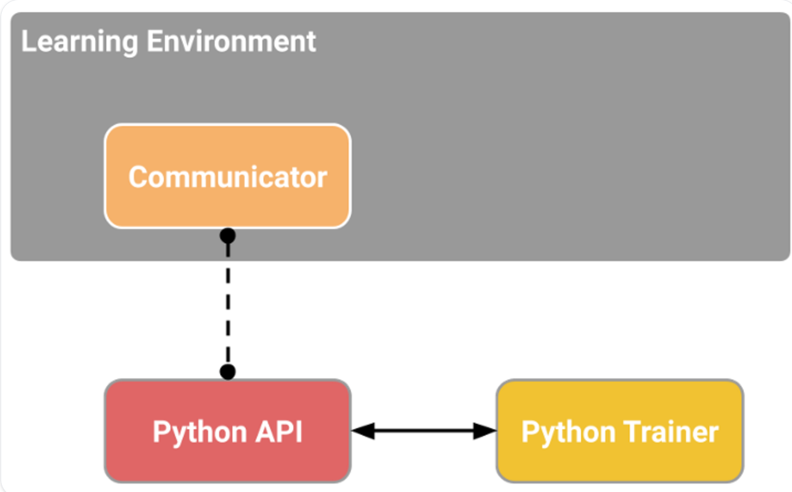

# Deep RL Course 学习笔记（下）

# **An Introduction to Unity ML-Agents**

强化学习的挑战之一就是创建环境。幸运的是我们可以利用游戏引擎去做这件事。Unity ML-Agents Toolkit就是一个Unity提供的，可以允许我们利用Unity游戏引擎作为环境创建者去训练agent.

## How do Unity ML-Agents work?

Unity ML-Agentsには6つの重要なコンポーネントがあります。

**The six components**

1. 1 つ目は学習環境で、Unity シーン (環境) と環境要素 (ゲーム キャラクター) が含まれています。
2. 2 つ目は Python Low-level API です。これには、環境と対話して操作するための低レベル Python インターフェイスが含まれています。トレーニングを開始するために使用する API です。
3. 学習環境（C#で作成）と低レベルのPython API（Python）を接続する外部コミュニケータ(External Communicator)があります。
4. Python トレーナー: PyTorch で作成された強化アルゴリズム (PPO、SAC など)。
5. ジムラッパー: RL環境をジムラッパーにカプセル化する
6. PettingZoo ラッパー: PettingZoo はジム ラッパーのマルチエージェント バージョンです

**Inside the Learning Component**

 Learning Componentには、2 つの重要な要素があります。

1つ目はエージェントコンポーネント、つまりシーンのアクターです。エージェントのポリシー（各状態でどのようなアクションを取るかを教えてくれる）を最適化することでエージェントをトレーニングします。ポリシーはBrainと呼ばれます。

2つ目はアカデミーです。このコンポーネントはエージェントとそのデシジョンメーキングを調整します。このアカデミーはPython APIリクエストを処理するの教師と考えてください。

アカデミーは、エージェントに注文を送信し、エージェントが同期していることを確認します：

Collect Observations　観察を収集 

Select your action using your policy　ポリシーを使用してアクションを選択します 

Take the Action　行動を起こす

Reset if you reached the max step or if you’re done.最大ステップに達した場合、または完了した場合はリセットします。

下記の図で、理解やすいと思います。

ML-Agents の仕組みを理解したので、エージェントをトレーニングする準備が整いました。

## The SnowballTarget Environment

SnowballTarget は、Kay Lousberg のアセットを使用して Hugging Face で作成した環境です。

**The agent’s Goal**

最初に訓練するエージェントは、クマのジュリアン 🐻 です。ジュリアンは雪玉でターゲットを攻撃するように訓練されています。

この環境での目標は、ジュリアンが限られた時間（1000タイムステップ）内にできるだけ多くのターゲットを攻撃することです。そのためには、ターゲットに対して正しく位置取りして射撃する必要があります。

さらに、「スノーボール スパム」(つまり、タイムステップごとにスノーボールを発射すること) を回避するために、Julien には「クールオフ」システムがあります (発射後、再度発射できるようになるまで 0.5 秒待つ必要があります)。

**The reward function and the reward engineering problem**

報酬関数は簡単です。エージェントの雪玉がターゲットにあたるたびに、環境は＋１の報酬を与えます。エージェントの目標は予想される累積報酬を最大化することであるため、エージェントはできるだけ多くのターゲットに当たるようにの努めます。

もっと複雑な報酬関数（例えばエージェントを速く　ためのペナルティなど）を用意することもできます。しかし、環境を設計するときには、報酬工学のもんだいを避ける必要がある。報酬工学の問題とは、エージェントに望むように行動させるには報酬関数が複雑すぎるという問題です。なぜでしょうか？そうすることで、簡単ですが面白い戦略を見逃してしまうの可能性がある。

**The observation space**

観察に関して、通常の視覚（フレーム）は使用せず、raycastsを使用する。

raycastsとは、オブジェクトを通過するかどうかを検出するlasers（レーザー激光）と考える。

この環境では、エージェントには複数のレイキャスト セットがあります

レイキャストに加えて、エージェントは「撃ってもいいか」というブール値を観測として受け取ります。

アクション空間は離散的です。

## The Pyramid environment

この環境での目標は、エージェントを訓練してピラミッドの頂上にある金のレンガを手に入れることです。そのためには、ボタンを押してピラミッドを生成し、ピラミッドまで移動し、ピラミッドを倒して頂上にある金のレンガまで移動する必要があります。

**The reward function**

報酬関数はステップごとに -0.001、ステップごとにこのマイナス報酬が与えられると、エージェントはより速く進むようになります。ゴールデンレンガに移動する場合、+2。

コードはこんな感じです。

そのボタンを探してピラミッドを破壊するこの新しいエージェントをトレーニングするには、次の 2 種類の報酬を組み合わせて使用します。

環境によって与えられる外在的なもの（上図）

しかし、好奇心と呼ばれる本質的なものもあります。この二番目の要素は、エージェントに好奇心を持たせる、言い換えれば、環境をよりよく探索するように促します。

好奇心について更に詳しく知りたい場合は、次のセクション（オプション）で基本について説明します。

**The observation space**

観察に関しては、それぞれオブジェクト（スイッチ、レンガ、金色のレンガ、壁）を検出できる１４８個のレイキャストを使用します。

また、スイッチの状態（ピラミッドを生成するためにスイッチをオンにしたかオフにしたか）を示すブール変数と、エージェントの速度を含むベクトルも使用します。

**The action space**

アクション空間は離散的であり、次の四つのアクションが可能です。

Forward Motion: UP/DOWN

Rotation: ROTATE LEFT / ROTATE RIGHT

## (Optional) What is Curiosity in Deep Reinforcement Learning?

深層強化学習における好奇心とは何ですか？

**Two Major Problems in Modern RL**

好奇心とは何ですかを理解するには、まずRLの二つの大きな問題を理解する必要がある。

①the sparse rewards problem:ほとんどの報酬には情報が含まれず、従ってゼロに設定される。

RLは報酬仮説、つまり各目標は報酬の最大化として記述できるという考えに基づいていることを覚えておいて。だから、報酬はRLエージェントのフィードバックとして機能します。報酬を受け取らなければ、どの行動が適切か？適切でないかに関する知識は変化しません。

例えば、ゲームDoom「DoomMyMayHome」に基づいた環境セットであるVizdoomでは、エージェントはベストを見つけた場合にのめ報酬を受け取る。ただし、ベストは開始地点から遠く離れているため、報酬はほとんどゼロになります。したがって、エージェントが有用なフィードバック（高密度の報酬）を受け取らないと最適なポリシーを学習するのに非常に長い時間がかかり、ゴールを見つけられないまま方向転換にじかんを費やす可能性があります。

②二つ目の大きな問題は、外在的報酬関数が手作であることです。つまり、それぞれの環境で、人間が報酬関数を実装する必要がある。しかし、大規模で複雑な環境でそれをどのように処理できるか？

**So what is Curiosity?**

これらの問題の解決策は、エージェントに固有の報酬関数、つまり、エージェント自身によって生成される報酬関数を開発することです。エージェントは学生である、自身のフィードバック　マスターであるため、自己学習者として機能します。

この内在的報酬メカニズムは、この報酬によってエージェントが新しい・知らないの状態を探索するように促されるため、エージェントは新しい方向を探索する時に高い報酬を受け取ります。

この報酬は人間の行動にヒントを得たものです。私たちは、環境を探索し、新しものを発見したいという本能な欲求を持っています。

この内在的報酬を計算する方法はいくつかあります。古典的なアプローチ (次の状態を予測する好奇心) では、現在の状態と実行されたアクションに基づいて、エージェントが次の状態を予測する際のエラーとして好奇心を計算します。

好奇心の考え方は、エージェントが自分の行動の結果を予測する能力における不確実性を減らすような行動をとるようにエージェントを促すことです。（エージェントがあまり時間を費やしていない領域や複雑なダイナミクスを持つ領域では不確実性が高くなります。）

エージェントがこれらの状態に多くの時間を費やすと、次の状態を予測するのが得意になります（好奇心が低い）、一方、新しい未探索の状態にある場合、次の状態を予測するのは難しくなります。（好奇心が高い）

好奇心を使用すると、エージェントは予測誤差の高い遷移を優先するようになります（エージェントが費やした時間が短い領域や、ダイナミクスが複雑な領域では予測誤差が高くなります）、結果として環境をより適切に探索できるようになります。

好奇心の計算方法はほかにもあります。ML-Agentsは、random network distillation（ランダムネットワーク蒸留）による好奇心と呼ばれるより高度な方法を使用します。

タスク２：hand-on→　 train our agents

# **ACTOR CRITIC METHODS WITH ROBOTICS ENVIRONMENTS**

### Introduction

ポリシーベースの方法では、値関数を使用せずにポリシーを直接最適化することを目指しています。もっとこ詳しく言うと、Policy-Gradient Methodと呼ばれるポリシーベースのメソッドのサブクラスの一部です。このサブクラスはグラデーションアセントを使用して最適なポリシーの重みを推定することにより、ポリシーを直接最適化します。

私たちは、Reinforceがうまくいったのを見ました。しかし、モンテカルロサンプリングを使用してリターンを推定するため（エピソード全体を使用してリターンを計算するため）、ポリシー勾配推定には大きな分散があります。

ポリシー勾配の推定は、リターンが最も急激に増加する方向であることを忘れないでください。言い換えれば、良いリターンにつながる行動が取られる可能性が高くなるように、ポリシーの重みをどのように更新するかです。このユニットでさらに研究するモンテカルロの分散は、それを軽減するために多くのサンプルが必要なため、トレーニングが遅くなります。

今日は、アクター　クリティク法を学びます。アクター　クリティック法は、価値ベースの方法とポリシーベースの方法を組み合わせたハイブリッドアーキテクチャで、分散を減らすことでトレーニングを安定させるのに役立ちます。

 ①エージェントの行動を制御するアクター（ポリシーベースの方法）

 ②取られた行動がどれほど良いかを推定する批評家（価値ベースの方法）

### **The Problem of Variance in Reinforce**

Trajectory（軌跡）とは：エージェントが環境で一連の行動を行い、得た結果（状態遷移や報酬）を指します。

Reinforceでは、報酬が高い軌跡に含まれる行動の確率を増やすことを目指します。

「高い報酬を得れれる行動を優先的に選べるよう、エージェントのポリシーを改善していく」という強化学習の根幹的な戦略

このリターンは*Monte-Carlo samplingを利用し、計算します。軌跡を収集し、リターンがたければ、軌跡中の全ての行動が「良い行動」と評価され、それらの行動確率が増加（強化）されます。*

このプロセスを繰り返すことで、ポリシー（行動を決定するルール）が徐々に洗練され、よりよい報酬を得られるようになります。

*軌道を収集し、割引リターンを計算し、このスコアを使用して、その軌道で取られたすべてのアクションの確率を増減します。*

このほうほうの利点は、偏りがないことです。リターンを推定していないため、得られる真のリターンのみを使用します。

環境の確率性（エピソード中のランダムなイベント）とポリシーの確率性を考慮すると、軌道によってリターンが異なり、大きな分散が生じる可能性があります。結果として、同じ開始状態であっても、リターンは大きく異なる可能性があります。このため、同じ状態から開始したリターンは、エピソードごとに大きく異なる可能性があります。

解決策は、多数の軌道を使用して分散を軽減し、いずれかの軌道で導入された分散が全体として減少し、リターンの「真の」推定値が得られることを期待することです。

ただし、バッチ サイズを大きくするとサンプル効率が大幅に低下します。そのため、分散を減らすための追加のメカニズムを見つける必要があります。

### Advantage Actor-Critic (A2C)

Reinforce アルゴリズムの分散を減らし、エージェントをより速く、より良くトレーニングするための解決策は、ポリシーベースの方法と値ベースの方法を組み合わせた Actor-Critic 方式を使用することです。

俳優-批評家を理解するには、ビデオゲームをプレイしていると想像してください.最初は遊び方が分からないので、ランダムにいくつかのアクションを試します。批評家はあなたのアクションを観察し、フィードバックをもらいました。

このフィードバックから学ぶことで、ポリシーを更新し、ゲームをより上手にプレイできるようになります。一方、あなたの友人（批評家）もフィードバックを提供する方法を更新し、次回はより良いものになるよう努めます。

これがActorーCriticの考え方です。ふたつの関数近似を学習します。

①エージェントの動作を制御するポリシー：π θ(s)

②実行されたアクションがどの程度優れているかを測定することでポリシーの更新を支援する価値関数：q ^w(s,a)

**学習プロセス：**

1. 状態の観測：環境から現在の状態 Stを取得

1. 行動の選択と評価：

Actorが状態から行動At を出力

Ctiticが状態と行動からQ値を計算

1. 環境と相互作用

選択された行動により新しい状態St+1 を取得

報酬Rt+1を受け取る

1. パラメータ更新

ActorはQ値を使用してパラメータを更新

新しい状態St+1 での次の行動At+1 を決定

Criticは価値パラメータを更新

关键点解释：

1. 虽然在第一个循环最后已经计算出At+1，但这个At+1是用于Critic更新的，不会直接用于下一循环
2. 每个新循环都会：
- 使用当前状态
- 通过更新后的Actor重新计算动作
- 这保证了使用最新的策略
1. 实际的时序是：
- t时刻：获得St -> 计算At -> 执行At -> 获得St+1和Rt+1
- 更新：更新Actor参数 -> 临时计算At+1用于Critic更新 -> 更新Critic参数
- t+1时刻：使用St+1 -> 用更新后的Actor重新计算动作

**Adding Advantage in Actor-Critic (A2C)**

1. Avantage関数の導入

Action 値関数の代わりにAvantage関数をCriticとして使用することで、学習を更に安定させることができる。

1. Advantage関数の考え方：

ある状態での平均的な価値と特定の行動を取った時の価値の差を計算し、つまり、その行動がどれだけ平均より良いかを示す。

1. 数学的な表現

A(s,a) = Q(s,a) - V(s)

- Q(s,a)：状態行動価値関数（じょうたいこうどうかちかんすう）
- V(s)：状態価値関数（じょうたいかちかんすう）
1. 勾配への影響

A(s,a) > 0：その行動の方向に強化

A(s,a) < 0：その行動と反対方向に強化

1. 実装上の工夫：
- TD誤差（ごさ）をAdvantage関数の推定値として使用
- これにより、二つの価値関数を個別に学習する必要がなくなる

# INTRODUCTION TO MULTI-AGENTS AND AI VS AI

### **Introduction**

シングルエージェントシステムは多くのアプリケーションに役立ちます。

しかし、人間はマルチエージェントの世界に生きています。私たちの知性は他のエージェントのやり取りから生まれます。したがって、私たちの目標は、ほかの人間やほかのエージェントとやり取りできるエージェントを作成することです。

適応、協力、競争が可能な堅牢なエージェントを構築するには、マルチエージェント システムで深層強化学習エージェントをトレーニングする方法を研究する必要があります。

そこで、マルチエージェント強化学習（MARL）という興味深いトピックの基礎を学びます。

### **An introduction to Multi-Agents Reinforcement Learning (MARL)**

**From single agent to multiple agents**

マルチエージェント強化学習を実行する場合、共通の環境で共有および相互作用する複数のエージェントが存在する状況になります。例えば、複数のロボットが移動して荷物を積み下ろす必要がある倉庫を想像してみてください。

**Different types of multi-agent environments**

マルチエージェント システムでは、エージェントが他のエージェントと対話するため、さまざまな種類の環境を持つことができます。

①協力的な環境: エージェントが共通の利益を最大化する必要がある環境。

  たとえば、倉庫では、ロボットが協力して荷物を効率的に（できるだけ早く）積み下ろしする必要があります。

②競争的/敵対的な環境: この場合、エージェントは相手の利益を最小限に抑えることで自身の利益を最大化したいと考えています。

たとえば、テニスのゲームでは、各エージェントは他のエージェントに勝つことを望んでいます。

③敵対的と協力的の両方が混在: SoccerTwos 環境と同様に、2 つのエージェントがチーム (青または紫) に所属し、互いに協力して相手チームに勝つ必要があります。

では、マルチエージェント システムをどのように設計すればよいのでしょうか。言い換えれば、マルチエージェント設定でエージェントをトレーニングするにはどうすればよいでしょうか。

### Designing Multi-Agents systems

このマルチエージェント強化学習システム (MARL) を設計するには、2 つのソリューションがあります。

**Decentralized system**

分散学習では、各エージェントは他のエージェントとは独立してトレーニングされます。上記の例では、各掃除機は他の掃除機 (エージェント) の動作を気にすることなく、できるだけ多くの場所を掃除することを学習します。

利点は、エージェント間で情報が共有されないため、単一のエージェントをトレーニングするのと同じように、これらのバキュームを設計およびトレーニングできることです。

ここでの考え方は、トレーニング エージェントが他のエージェントをエージェントとしてではなく、環境ダイナミクスの一部として考慮するというものです。

しかし、この技術の大きな欠点は、ほかのエージェントも環境と相互作用するため、基礎となるマルコフ決定過程が時間とともに変化し、かんきょうが非定常になることです。

そして、これは多くの強化学習アルゴリズムにとって問題となります。なぜなら、非定常な環境では大域的最適解に到達できないからです。

**Centralized approach**

集中型アプローチ（Centralized Approach）について説明します：

1.基本構造（きほんこうぞう）

- 高レベルのプロセスが各エージェントの経験（けいけん）を収集
- 共通の経験バッファを使用
- 全エージェントで共有する方策（ほうさく）を学習

2.掃除ロボットの例
観測情報（かんそくじょうほう）：

- 掃除範囲（そうじはんい）の地図
- 全ロボットの位置情報（いちじょうほう）

3.学習方式の特徴

- 集団としての最適な行動を学習
- 全ロボットが共通の経験から学習
- 環境が定常（ていじょう）になる
    - 全エージェントを一つの大きな実体として扱う
    - 他のエージェントの方策変更も把握可能

4.分散型と集中型の比較
分散型（ぶんさんがた）：

- エージェントを独立して扱う
- 他エージェントは環境の一部として認識
- 非定常環境により収束（しゅうそく）の保証なし

集中型（しゅうちゅうがた）：

- 単一の方策を全エージェントで学習
- 環境の現状から共同行動を決定
- 報酬（ほうしゅう）はグローバル

### Self-Play: a classic technique to train competitive agents in adversarial games

we’re going to train agents in an adversarial game with SoccerTwos, a 2vs2 game.

**What is Self-Play?**

対戦型ゲームでエージェントを正しく訓練することは非常に複雑です。
一方では、訓練中のエージェントと対戦する優れた相手を見つける必要があります。他方で、非常に強い相手が見つかった場合、相手が強すぎるとエージェントはどのように方策を改善できるでしょうか？

サッカーを始めたばかりの子供を考えてみましょう。非常に優れたサッカー選手と対戦しても、勝つことや時々ボールを奪うことが難しすぎるため無意味です。そのため、子供は良い方策を学ぶ時間もないまま、継続的に負け続けることになります。

最良の解決策は、エージェントと同じレベルの相手を用意し、エージェントがレベルアップするにつれて相手もレベルアップすることです。相手が強すぎると何も学べず、弱すぎると、より強い相手に対して役に立たない行動を過度に学習してしまうからです。

この解決策がセルフプレイです。セルフプレイでは、エージェントは自身の方策の過去のコピーを相手として使用します。これにより、エージェントは同じレベルの相手（適度な難しさ）と対戦し、徐々に方策を改善する機会を得て、上達するにつれて相手を更新します。これは相手をブートストラップし、徐々に相手の複雑さを増加させる方法です。

これは人間が競争で学ぶのと同じ方法です：

- 同じレベルの相手と練習を始める
- そこから学び、スキルを習得したら、より強い相手に進む

セルフプレイでも同様です：

- 同じレベルになるよう、エージェントのコピーを相手として開始
- そこから学び、スキルを習得したら、より最新の訓練方策のコピーで相手を更新

セルフプレイの理論は新しいものではありません。1950年代のArthur Samuelのチェッカープレイヤーシステムや、1995年のGerald TesauroのTD-Gammonですでに使用されていました。

**Self-Play in MLAgents**

セルフプレイ（自己対戦）は MLAgents ライブラリに統合されており、これから学習する複数のハイパーパラメータによって管理されています。ドキュメントで説明されているように、主な焦点は、最終的な方針のスキルレベルと汎用性、そして学習の安定性のトレードオフにあります。

**The ELO Score to evaluate our agent**

What is ELO Score?

ELOスコアとは何か？
対戦ゲームでは、累積報酬は必ずしも学習の進捗を追跡する意味のある指標とはなりません。なぜなら、この指標は相手のスキルにのみ依存するからです。
その代わりに、私達はELOレーティングシステム（アルパッド・イロー氏にちなんで命を使用します。これはゼロサムゲームにおける特定の母集団から選ばれた2人のプレイヤー間の相対的なスキルレベルを計算します。
ゼロサムゲームでは、一方のエージェントが勝ち、もう一方が負けます。これは各参加者の効用の得失が他の参加者の効用の得失と正確にバランスを取る状況の数学的な表現です。
ELO（通常1200点からスタート）は、最初は減少することもありますが、訓練の過程で徐々に増加していくはずです。

ELOシステムは、他のプレイヤーとの対戦における敗北と引き分けから推論されます。つまり、プレイヤーの評価値は、対戦相手の評価値と、その対戦結果に依存します。
ELOは、ゼロサムゲームにおけるプレイヤーの相対的技能値をELOスコアとして定義します。相対的という理由は、対戦相手のパフォーマンスに依存するためです。
基本概念は、プレイヤーのパフォーマンスを正規分布する確率変数として考えることです。
2名のプレイヤー間の評価値の差は、対戦結果の予測因子として機能します。勝利しても、勝利確率が高い場合は、相手より圧倒的に強いことを意味するため、獲得ポイントは少なくなります。

各試合の後：
勝者は敗者からポイントを獲得します。
獲得ポイント数は、2人のプレイヤーの評価値の差によって決定されます（つまり相対的）。
高評価プレイヤーが勝った場合→ 低評価プレイヤーから少ないポイントが移動
低評価プレイヤーが勝った場合→ 高評価プレイヤーから多くのポイントが移動
引き分けの場合→ 低評価プレイヤーが高評価プレイヤーから少ないポイントを獲得

プレイヤーAとBの評価値がそれぞれRa、Rbの場合、期待スコアは以下の通りです。

次に、ゲームの終了時に、プレイヤーの実際の Elo スコアを更新する必要があります。プレイヤーのパフォーマンスが過剰または不足した量に比例する線形調整を使用します。

また、ゲームごとの最大調整評価、K 係数も定義します。 マスターの場合、K = 16。 弱いプレーヤーの場合、K = 32。 プレーヤー A が Ea ポイントを持っているが、Sa ポイントを獲得した場合、プレーヤーの評価は次の式を使用して更新されます。

**利点**：
ELOスコアの使用には複数の利点があります：

- ポイントが常にバランスを保ちます（予期せぬ結果の際はより多くのポイントが交換されますが、合計は常に同じです）。
- 自己修正システムです。強いプレイヤーが弱いプレイヤーに勝っても、獲得ポイントは少なくなります。
- チームゲームにも対応：各チームの平均値を算出し、ELOに使用します。

**欠点**：

- チーム内の各個人の貢献度が考慮されません。
- レーティングのデフレーション：良い評価を維持するには時間をかけたスキルが必要です。
- 過去のレーティングとの比較ができません。

# **Proximal Policy Optimization (PPO)**

### Introduction

（ps：我放弃用日语写了。我最近听到过的一个有意思的说法是，出了国才发现，不是这个东西你不懂，是用日语或者英语说你不懂，花好长时间搞不容易搞明白了，一拍脑门，这东西我早就知道了哇。）

PPO（近端策略优化） 是一种强化学习（Reinforcement Learning, RL）算法，由 OpenAI 在 2017 年提出，广泛用于机器人控制、游戏 AI、自动驾驶等领域。PPO 以简单、稳定、计算效率高著称，并成为许多 RL 应用的标准算法。

PPO 是一种 **策略梯度（Policy Gradient）** 方法，它属于直接优化策略（Policy Optimization）的强化学习算法。

其核心思想是：

✅ **让新策略不会偏离旧策略太远**（避免剧烈更新导致训练不稳定）。

✅ **使用裁剪（Clipping）方法控制策略更新步长**，使得训练既稳定又高效。

PPO 主要解决了 **TRPO（Trust Region Policy Optimization）计算复杂**的问题，同时保持了类似的性能。

### The intuition behind PPO

在 RL 中，常见的方法包括：

1. 值迭代（Value-Based）方法（如 DQN）
    - 通过学习 Q-Value 来选择最优动作。
    - 适用于离散动作空间，但不适用于连续动作空间。
2. 策略梯度（Policy Gradient, PG）方法（如 REINFORCE）
    - 直接优化策略 πθ(a∣s)，可用于 连续动作空间。
    - 但原始 PG 方法更新不稳定，容易发生 梯度爆炸/消失。
3. TRPO（Trust Region Policy Optimization）
    - 通过 KL 散度（Kullback-Leibler Divergence）约束来限制策略更新的大小，防止策略发生剧烈变化。
    - 但 TRPO 计算复杂，需要求解二阶优化问题，不易实现。

**➡ PPO 作为 TRPO 的改进版，通过 Clipping 技术避免了昂贵的计算，使得训练更加稳定、高效！**

PPO 主要有 两种实现方式：

1. PPO-Clip（最常用）：
    - 通过 裁剪（Clipping） 限制策略更新幅度，确保稳定性。
    - 计算简单，适用于大多数任务。
2. PPO-KL（较少使用）：
    - 通过 KL 散度惩罚项 控制新旧策略的差异。
    - 类似 TRPO，但比 PPO-Clip 计算开销更大。

💡 实际应用中，PPO-Clip 更常用，因为它简单高效，容易实现。

### Introducing the Clipped Surrogate Objective Function

Clipped Surrogate Objective Function 是 近端策略优化算法（Proximal Policy Optimization, PPO） 中的关键优化目标。它的主要作用是限制策略更新的幅度，防止策略发生过大的变化，从而提高训练的稳定性。

在强化学习中，如果策略更新幅度过大，可能会导致：

- 训练不稳定
- 性能突然下降
- 策略崩溃（策略完全偏离了原有方向）

Clipped Surrogate Objective Function 通过 限制策略更新的步长 来解决这个问题，使策略在合理范围内改进。

- ϵ 是一个超参数（通常取 0.1-0.2），用于控制策略的最大变化幅度。
- clip(rt(θ),1−ϵ,1+ϵ) 限制了 **rt(θ)** 的取值范围：
    - 如果 rt​(θ) 超过 1+ϵ 或小于 1−ϵ，则截断到该范围内。

这个裁剪函数的作用是：

- 如果策略变化幅度在合理范围内（rt(θ) 处于 [1 - ε, 1 + ε]），就正常优化。
- 如果策略变化过大（rt(θ) 超出了这个范围），则 忽略掉超出的部分，避免过度更新。

### Conclusion

- Clipped Surrogate Objective Function 是 PPO 算法中的核心思想，用于防止策略更新幅度过大，保证训练的稳定性。
- 其核心操作是 裁剪概率比率 rt(θ)，避免过度优化。
- 直观来看，PPO 让策略更新“不过头”，既能提升策略，又能保持稳定。

## 补充：PPO 的优缺点

✅ 优点：

- 训练 稳定，相比 DQN、原始策略梯度，收敛性更好。
- 计算 高效，相比 TRPO，计算更简单，无需二阶优化。
- 适用于 连续和离散动作空间。

❌ 缺点：

- 仍然需要 较长时间训练（比 DQN 慢）。
- 超参数（如 ϵ）需要调优，不同任务效果不同。