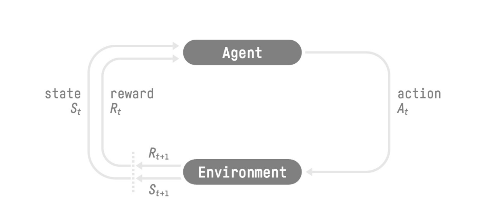

# Deep RL Course 学习笔记（上）

## **Introduction to Deep Reinforcement Learning**

The best way to learn and [**to avoid the illusion of competence**](https://www.coursera.org/lecture/learning-how-to-learn/illusions-of-competence-BuFzf) **is to test yourself.**

学习和避免能力幻觉最好的方式就是测试你自己。

所以这篇学习笔记的架构是由多个问题组成，通过对知识点的剖析，汇总成一些问题，通过向自己提问的方式，整合知识。

**Q1: What is Reinforcement Learning?（什么是强化学习）**

我们先来下一个定义：

Reinforcement learning is a framework for solving control tasks (also called decision problems) by building agents that learn from the environment by interacting with it through trial and error and receiving rewards (positive or negative) as unique feedback.

强化学习是一个为了解决控制问题（也被称作决策问题）的一个框架，通过建立一个【通过实验和错误来和环境互动来学习的agent（智能体）】，作为独特反馈获得奖励。

强化学习的idea来源于 一个agent（智能体）通过探索环境和获得奖励（积极或消极）所谓一个反馈，来采取行动。这个和我们人类学习的行为非常相似。比如当我们玩通关游戏时，我们会尝试各种方法，获得反馈，知道哪种方法可以成功通关，什么方法会失败。没有任何人告诉你应该如何通关的情况下，我们自己也会在玩游戏的时候，变得越来越擅长。这就是人类和动物如何学习。我们是通过和环境互动来学习的。强化学习只是一种从行动中学习的计算方法。

**Q2: Define the RL Loop（定义一个RL循环）**

这个RL循环输出一系列状态、操作、奖励和下一个状态。

agent接收到了一个状态State St

基于St，agent采取了action At

环境变成了新的状态St+1

环境给出了一些奖励 rewoard Rt给Agent

然后重复这个循环，agent接收到了状态 State St+1。。。。。。

The agent’s goal is to *maximize* its cumulative reward, **called the expected return.（agent的目标是最大化累积奖励）👉这就是强化学习的 central idea—奖励机制，也是为什么强化学习会采取最佳行为。**

**Q3: What’s the difference between a state and an observation?（state和observation的区别是什么）**
• *State s*: is **a complete description of the state of the world** (there is no hidden information). In a fully observed environment.

*State是一个世界（没有隐藏信息）状态的完整描述。在一个完全被观察到的环境中。*

• *Observation o*: is a **partial description of the state.** In a partially observed environment.

*Observation是对状态的部分表述，它是一个部分可见的环境。*

举个例子来说，下棋的时候，整个棋盘的信息都是完整可见的。这是State。

当玩儿马里奥的时候，视角只能看到部分关卡，看不到后面的所有关卡。这就是Observation

**Q4: A task is an instance of a Reinforcement Learning problem. What are the two types of tasks?**

强化学习的问题，会有两种类型的任务。Episodic和Continuing

区分点是有无最终状态

Episodic：有一个开始的时间点，和一个结束的时间点，比如马里奥游戏，有开始，必然有结束状态（死掉或者通关）

Continuing：任务会永远持续下去（没有最终状态）。比如股票交易，对于这个任务来说。agent会持续运行，直到我们决定停下来。

**Q5: What is the exploration/exploitation tradeoff?（什么是探索和利用权衡）**

- *Exploration* is exploring the environment by trying random actions in order to **find more information about the environment.**

探索是通过尝试自由行为去发现更多信息的探索环境的行为。

- *Exploitation* is **exploiting known information to maximize the reward.**

利用是利用已知信息去最大化奖励。

我们需要去平衡 探索环境｜利用已知。

举个例子，选择两个吃饭的饭店，一个是经常去吃的店，一个是新店。如果你选择每天去同一家店吃饭，就会有错失另一个更好饭店的风险。 如果尝试了之前没有去过的店，就会有好 坏 两种可能性。

**Q6: What is a policy?**

我们怎样解决RL问题，换句话说，我们如何建立一个 RL agent让它能够选择最大化期待累积奖励的行为。

policy是agent的大脑，它的功能是告诉我们，在当前状态下我们采取什么行动。所以它实际上定义了agent的行为。

**Q7: What are value-based methods?**
• Indirectly, **teach the agent to learn which state is more valuable** and then take the action that **leads to the more valuable states**: Value-Based Methods.

间接地，教agent了解哪种状态更有价值，然后采取导致更有价值状态的行动：基于价值的方法。

在基于值的方法中，我们不学习策略函数，而是学习一个值函数，该函数将状态映射到处于该状态的预期值。

状态的价值是agent从该状态开始，然后根据我们的政策行事（意味着该状态的最高价值），可以获得的预期折扣回报。

**Q8: What are policy-based methods?**

• **Directly,** by teaching the agent to learn which **action to take,** given the current state: **Policy-Based Methods.**

直接通过教给agent去学习在当前状态下应该采取什么行动：基于策略的方法。

我们有两种策略：
• *Deterministic*: a policy at a given state **will always return the same action.**

给定一个状态总是返回同样的动作。

• *Stochastic*: outputs **a probability distribution over actions.**

随机：输出动作的概率分布。

## **Introduction to Q-Learning**

Q-Learning是RL当中 基于**value-based methods的一种算法。**

**Mid-way Quiz：**

**Q1: What are the two main approaches to find optimal policy?**

基于策略的方法 和 基于值的方法。

Policy-Based methods：通过基于策略的方法，我们直接训练策略，以了解给定状态时要采取哪些行动。

value-based methods：通过基于值的方法，我们训练一个值函数去学习哪种状态是价值更高的，然后使用这个值函数指导它去选择行为。

**Q2: What is the Bellman Equation?**

Bellman方程是一个递归方程，它的工作方式是：不是从头开始计算累积回报，我们可以考虑每个状态的值：Rt+1 + gamma * V(St+1) —》 立即奖励 +未来可能回报的加总

**Q3: Define each part of the Bellman Equation**

**Q4: What is the difference between Monte Carlo and Temporal Difference learning methods?**

With Monte Carlo methods, we update the value function from a complete episode

With TD learning methods, we update the value function from a step

他们都是强化学习中，主要的值函数估计方法。

| 特性 | Monte Carlo (MC) | Temporal Difference (TD) |
| --- | --- | --- |
| 更新时机 | 回合结束后 | 每一步后 |
| 回报计算 | 实际总回报 | 估计回报 |
| 依赖完整回合 | 是 | 否 |
| 方差与偏差 | 方差大，无偏 | 方差小，有偏 |
| 适用任务类型 | 有明确回合结束的任务 | 持续性任务 |
| 学习速度 | 相对较慢 | 相对较快 |

**Q5: Define each part of Temporal Difference learning formula**

**Q6: Define each part of Monte Carlo learning formula**

**Q-Learning Quiz：**

**Q1: What is Q-Learning?**

Q-Learning是一个off-policy 值函数方法，使用TD 方法去训练它的 action-value 函数。

*Off-policy：*

*TD approach：每一步都更新值函数*

*Value-based method*:寻找最优policy的方法之一

If we recap, *Q-Learning* **is the RL algorithm that:**

- Trains a *Q-function* (an **action-value function**), which internally is a **Q-table that contains all the state-action pair values.**
- Given a state and action, our Q-function **will search its Q-table for the corresponding value.**
- When the training is done, **we have an optimal Q-function, which means we have optimal Q-table.**
- And if we **have an optimal Q-function**, we **have an optimal policy** since we **know the best action to take at each state.**

Q-Learning是一个我们用来训练Q-function的算法，给定一个状态和动作，我们的Q函数输出一个 Q-value（也被称为 state-action value）。

**Q2: What is a Q-table?**

Q-table is the internal memory of our agent

**a Q-table, a table where each cell corresponds to a state-action pair value.** Think of this Q-table as **the memory or cheat sheet of our Q-function.**

**Q3: Why if we have an optimal Q-function Q* we have an optimal policy?**

因为如果我们有一个最佳的Q函数，我们就有一个最佳的政策，因为我们知道每个状态的最佳行动是什么。

**Q4: Can you explain what is Epsilon-Greedy Strategy?**

Epsilon贪婪策略是一项处理探索/利用权衡的政策。

The idea is that we define epsilon ɛ = 1.0:

- With *probability 1 — ɛ* : 我们执行利用 (aka our agent selects the action with the highest state-action pair value).
- With *probability ɛ* : 我们执行探索 (尝试自由行为).

**Q5: How do we update the Q value of a state, action pair?**

**Q6: What’s the difference between on-policy and off-policy**

**On-policy (策略内学习)**

在On-policy方法中，学习的策略与执行的策略是相同的。也就是说，代理在与环境交互时，按照当前正在学习的策略来选择动作，并通过这些动作的反馈更新这个策略。

**Off-policy (策略外学习)**

在**Off-policy**方法中，**学习的策略**与**执行的策略**是不同的。

代理在环境中**执行某个策略**来收集数据，但使用这些数据来学习一个不同的策略，通常是**目标策略**（target policy），该策略通常是最优策略。Off-policy方法允许代理使用一个探索性较强的策略来收集经验，但学习的是一个更加贪婪、利用当前最佳策略的策略。这使得代理能够更有效地探索环境，同时致力于学习一个更好的策略。

### **UNIT3 DEEP Q-LEARNING WITH ATARI GAMES**

**Q1: We mentioned Q Learning is a tabular method. What are tabular methods?**

*Tabular methods是一类问题，状态和动作空间足够小去近似值函数可以被表现为数组和表。例如，当我们使用表格去表示状态和动作的value pairs时，Q-Learning时一个tabular method*

**Q2: Why can’t we use a classical Q-Learning to solve an Atari Game?**

Atari environments have a big observation space. So creating an updating the Q-Table would not be efficient。

**Q3: Why do we stack four frames together when we use frames as input in Deep Q-Learning?**

我们为什么要把四个框架堆在一起？我们把框架堆在一起，因为它有助于我们处理时间限制的问题。因为单一的图片来说，根本无法知道物体随着时间是如何移动的。但是如果我们增加更多的图片，我们就可以看到物体时如何移动的

**Q4: What are the two phases of Deep Q-Learning?**

The Deep Q-Learning training algorithm has *two phases*:

- **Sampling**: we perform actions and **store the observed experience tuples in a replay memory**.
- **Training**: Select a **small batch of tuples randomly and learn from this batch using a gradient descent update step**.

采样：我们执行操作，并将观察到的经验元组存储在重播记忆中。

训练：随机选择一小批元组，并使用梯度下降更新步骤从这批中学习。

**Q5: Why do we create a replay memory in Deep Q-Learning?**

**1. Make more efficient use of the experiences during the training**

Usually, in online reinforcement learning, the agent interacts in the environment, gets experiences (state, action, reward, and next state), learns from them (updates the neural network), and discards them. This is not efficient. But, with experience replay, **we create a replay buffer that saves experience samples that we can reuse during the training**.

**2. Avoid forgetting previous experiences and reduce the correlation between experiences**

The problem we get if we give sequential samples of experiences to our neural network is that it **tends to forget the previous experiences as it overwrites new experiences**. For instance, if we are in the first level and then the second, which is different, our agent can forget how to behave and play in the first level.

**Q6: How do we use Double Deep Q-Learning?**

When we compute the Q target, we use two networks to decouple the action selection from the target Q value generation. We:

- Use our *DQN network* to **select the best action to take for the next state** (the action with the highest Q value).
- Use our *Target network* to calculate **the target Q value of taking that action at the next state**.

当我们计算Q目标时，我们使用两个网络将操作选择与目标Q值生成分离。

使用我们的DQN网络选择下一个状态的最佳操作（Q值最高的操作）。

使用我们的目标网络来计算在下一个状态下采取该操作的目标Q值。

### **UNIT4 POLICY GRADIENT WITH PYTORCH**

Deep Q-Learning是一个value-based的深度强化学习算法，其内涵是使用深度神经网络为每一个可能的行为最优化Q值。之前，我们只研究了基于价值的方法，其中我们预估价值函数作为寻找最佳策略的中间步骤。

在基于价值的方法中，策略（π）仅仅因为动作价值估计而存在，因为策略只是一个函数（例如，贪婪策略），它将在给定状态下选择具有最高价值的动作。

对于基于策略的方法，我们希望直接优化策略，而无需学习价值函数的中间步骤。

所以今天，我们将学习基于策略的方法的一个子集，称为策略梯度。然后，我们将使用 PyTorch 从头开始实现我们的第一个策略梯度算法，称为 Monte Carlo Reinforce。

**What are the policy-based methods?**

首先来定义一下，什么是基于策略的方法。

强化学习的主要目标是找到能够最大化预期累积奖励的最佳策略 𝜋 。因为强化学习基于奖励假设：所有目标都可以描述为预期累积奖励的最大化。举个例子，一场足球比赛的场景中，目标是赢得比赛，那么我们可以在强化学习中将这一目标描述为：最大化进球数（当球越过球门线时）进入对手的足球球门。同时最小化自己足球球门的进球数。

1.前面提到过，我们了解了两种方法去找到最佳策略。在value-based方法中，我们学习一个值函数。

这个idea是说一个最优的值函数会导致最佳策略。我们的目标是最小化预测值和目标值之间的损失来近似真实的动作-值函数。

我们有策略，但是它是隐式的，因为是从价值函数直接生成的，比如，在Q-learning中，我们使用了(epsilon-)greedy策略。

2.如果是 policy-based methods，我们直接学习近似 𝜋 ∗ ，而无需学习价值函数。

这个idea是将策略参数化。例如，使用神经网络 𝜋 𝜃 π θ，该策略将输出动作的概率分布（随机策略）。

我们的目标是利用梯度上升来最大化参数化策略的性能。

为了做到这一点，我们控制参数θ，它将影响一个状态下的动作分布。

因此，得益于基于策略的方法，我们可以直接优化我们的策略 𝜋 𝜃 以输出动作 𝜋 𝜃 ( 𝑎 ∣ 𝑠 )的概率分布，从而获得最佳累积回报。

**The advantages and disadvantages of policy-gradient methods.**

你可能会问Deep Q-Learning这个方法已经很好了，为什么还需要用梯度策略呢？为了回答这个问题，我们来讨论一下策略梯度的优缺点。

**Advantages**

1.集成简单，我们可以直接评估这个策略为不需要存储额外的数据。

2.策略梯度方法可以学习随机策略，而价值函数则不能。价值函数在做‘确定性策略’

这会带来两个好处是，1.我们不需要去手动做探索/利用权衡。由于我们输出的是动作的概率分布，因此代理会探索状态空间，而不会始终采取相同的轨迹。2.我们还解决了感知混叠问题。感知混叠是指两种状态看起来（或确实）相同但需要采取不同行动的情况。

3.策略梯度方法在高维动作空间和连续动作空间中更有效。

深度 Q 学习的问题在于，在给定当前状态的情况下，它们的预测会为每个可能的动作、在每个时间步骤中分配一个分数（最大预期未来奖励）。但是如果我们的动作可能性是无限的呢？例如，对于自动驾驶汽车，在每个状态下，你可以有（几乎）无限多种操作选择（将方向盘转动 15°、17.2°、19.4°、鸣喇叭等）。我们需要为每个可能的动作输出一个 Q 值，而采取连续输出的最大动作本身就是一个优化问题！相反，通过策略梯度方法，我们输出动作的概率分布。

4.策略梯度方法具有更好的收敛特性

简单来说，在策略梯度方法中，随机策略行动偏好（采取行动的概率）会随着时间的推移平稳变化。

**Disadvantages**

1.通常，策略梯度方法会收敛到局部最大值而不是全局最大值。

2.策略梯度逐渐变慢：训练可能需要更长的时间（效率低下）

3.策略梯度可能具有较高的方差。

Q1: What are the advantages of policy-gradient over value-based methods?

与基于价值的方法相比，策略梯度有哪些优势

1.策略梯度方法可以学习随机策略

2.策略梯度方法在高维动作空间和连续动作空间中更有效

Q2: What is the Policy Gradient Theorem?

The Policy Gradient Theorem is a formula that will help us to reformulate the objective function into a differentiable function that does not involve the differentiation of the state distribution.

策略梯度定理是一个公式，它可以帮助我们将目标函数重新表述为可微函数，而不涉及状态分布的微分。

Q3: What’s the difference between policy-based methods and policy-gradient methods? 

基于策略的方法和策略梯度方法之间的区别

策略梯度方法是基于策略的方法的一个子类。

这两种方法的区别在于我们如何优化参数 𝜃

1.在基于策略的方法中，我们直接搜索最优策略。这种方法是通过优化某个目标函数的局部近似来**间接**地优化参数。可以使用hill climbing（爬山算法）, simulated annealing（模拟退火）, or evolution strategies（演化策略）等技术来寻找最优策略。

2.策略梯度方法是策略基方法的一个子类，因此同样是直接搜索最优策略。但和policy-based methods 不同的是，它**直接**对目标函数J(θ)进行梯度上升来优化参数θ。

Q4: Why do we use gradient ascent instead of gradient descent to optimize J(θ)?

我们想要最大化 J(θ)，梯度上升给出了 J(θ) 最急剧增加的方向。